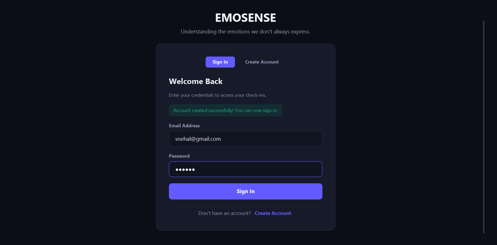
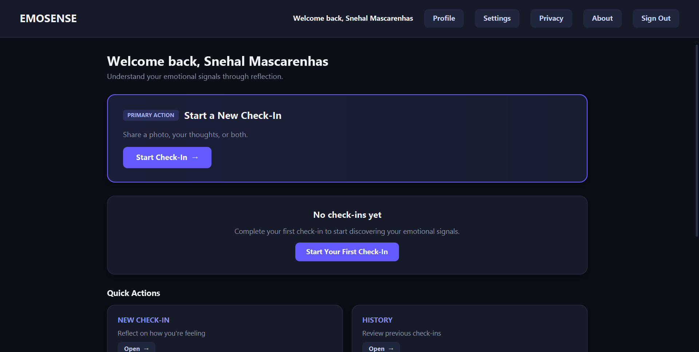
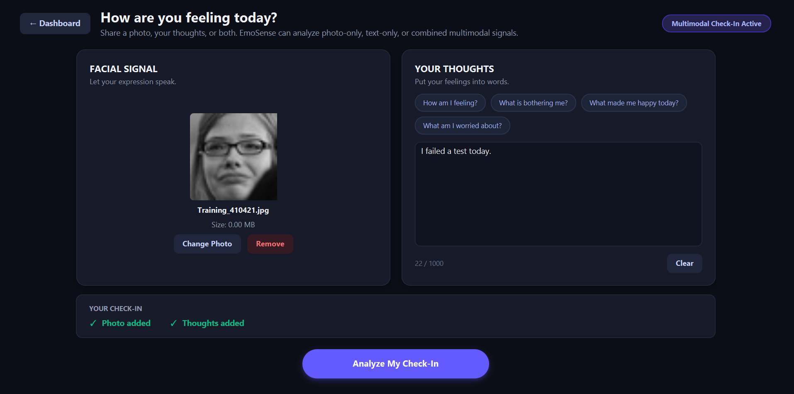
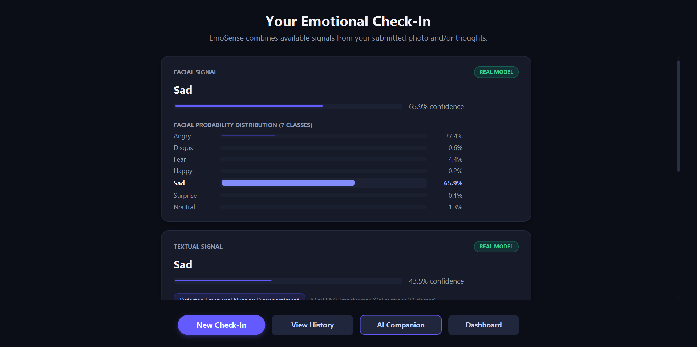
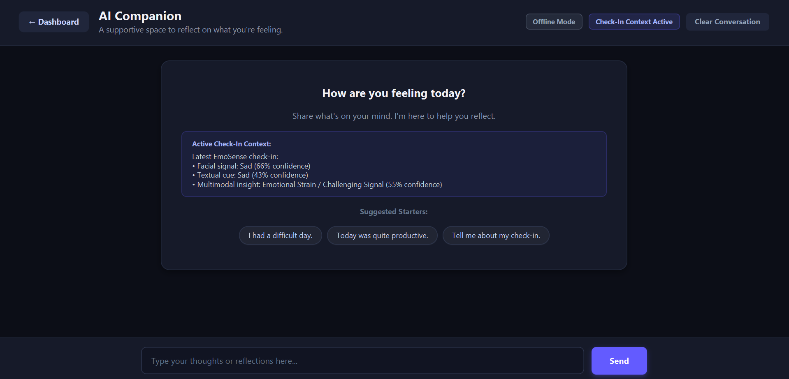

# EmoSense

## AI-Driven Multimodal Emotional Signal Analysis System

> **Understanding the emotions we don't always express.**

EmoSense is a Java-based AI application that analyzes emotional signals from **facial expressions and text**. It combines the outputs from both modalities to generate a multimodal emotional insight and provide supportive, non-clinical responses.

The project demonstrates the integration of **Artificial Intelligence, Computer Vision, Natural Language Processing, ONNX-based model inference, database management, and Generative AI** into a single desktop application.

---

## 📌 Project Overview

EmoSense allows users to complete an emotional check-in by:

- Uploading a facial image
- Entering their thoughts or feelings as text
- Using facial input, text input, or both
- Analyzing emotional signals using AI models
- Viewing emotion predictions and confidence values
- Receiving a combined multimodal insight
- Viewing previous check-ins and insights
- Interacting with an AI Companion

EmoSense is designed for **emotional awareness and self-reflection**. It is an academic prototype and does **not provide medical or psychological diagnosis**.

---

## ✨ Key Features

- 🔐 User Sign Up and Sign In
- 📷 Facial Expression Analysis
- 📝 Text Emotion Analysis
- 🧠 Multimodal Emotional Signal Analysis
- 📊 Emotion Confidence Visualization
- 📜 Check-In History
- 📈 Personal Insights
- 💬 AI Companion
- 🗄️ MySQL Database Integration
- 🔄 Offline Fallback Support
- 🛡️ Privacy and Responsible AI Considerations

---

## 🖼️ Screenshots

### 🔐 Sign In

<!-- Add your Sign In screenshot here -->



---

### 🏠 Dashboard

<!-- Add your Dashboard screenshot here -->



---

### 📝 Emotional Check-In

<!-- Add your Check-In screenshot here -->



---

### 📊 Analysis Results

<!-- Add your Results screenshot here -->



---

### 💬 AI Companion

<!-- Add your AI Companion screenshot here -->



---

## 🤖 AI Models Used

### 1. Facial Emotion Recognition

**Model:** `onnx-community/face-emotion-detection-ONNX`

Used to analyze facial expressions from uploaded images.

The model recognizes seven facial emotion classes:

- Angry
- Disgust
- Fear
- Happy
- Sad
- Surprise
- Neutral

---

### 2. Text Emotion Recognition

**Model:** `minuva/MiniLMv2-goemotions-v2-onnx`

Used to identify emotional signals from user-provided text.

The model is based on the **GoEmotions** dataset and provides emotion probabilities that are mapped by EmoSense into broader emotional signals for multimodal analysis.

---

### 3. Face Detection

**Model:** `UltraFace RFB-320`

Used to detect and locate the face in an uploaded image before facial emotion analysis.

---

## 🔄 System Workflow

```text
                    User Check-In
                         │
             ┌───────────┴───────────┐
             │                       │
       Facial Image             Text Input
             │                       │
             ▼                       ▼
      Face Detection          Text Processing
             │                       │
             ▼                       ▼
    Facial Emotion Model    Text Emotion Model
             │                       │
             └───────────┬───────────┘
                         ▼
                Multimodal Analysis
                         │
                         ▼
                Emotional Insight
                         │
             ┌───────────┴───────────┐
             ▼                       ▼
          Results              AI Companion
             │
             ▼
       History & Insights
## 🧩 System Architecture

```text
                    JavaFX User Interface
                             │
                             ▼
                    Application Services
                             │
             ┌───────────────┼───────────────┐
             │               │               │
             ▼               ▼               ▼
       Facial Analysis  Text Analysis   AI Companion
             │               │               │
             ▼               ▼               ▼
          ONNX Model      ONNX Model     Gemini API /
                                            Local Fallback
             │               │
             └───────┬───────┘
                     ▼
              Multimodal Analysis
                     │
                     ▼
                MySQL Database
```

---

## 🛠️ Technology Stack

| Technology | Purpose |
|------------|---------|
| **Java 17** | Core application development |
| **JavaFX** | Desktop user interface |
| **ONNX Runtime** | AI model inference |
| **MySQL** | Persistent data storage |
| **JDBC** | Database connectivity |
| **Maven** | Build and dependency management |
| **Gemini API** | AI Companion responses |
| **Git & GitHub** | Version control |

---

## 📚 Datasets

EmoSense uses publicly available emotion-related datasets associated with the underlying models:

- **FER2013** – Facial Expression Recognition
- **GoEmotions** – Textual Emotion Recognition

The deployed emotion models are **pre-trained/fine-tuned models**. EmoSense integrates these models for inference rather than training the models from scratch.

---

## 🧠 How the AI Analysis Works

### Facial Analysis

```text
Uploaded Image
      ↓
Face Detection
      ↓
Image Preprocessing
      ↓
Facial Emotion Model
      ↓
Emotion Probabilities
      ↓
Facial Emotional Signal
```

### Text Analysis

```text
User Text
    ↓
Tokenization
    ↓
Text Emotion Model
    ↓
Emotion Probabilities
    ↓
Textual Emotional Signal
```

### Multimodal Analysis

```text
Facial Emotional Signal
          +
Textual Emotional Signal
          ↓
   Signal Comparison
          ↓
 Multimodal Insight
```

The system uses model confidence values and does not treat emotion predictions as absolute facts.

---

## 🔒 Privacy & Responsible AI

EmoSense is an **academic prototype** designed for emotional awareness and self-reflection.

- Facial images are used for facial emotion analysis.
- Emotion predictions are probabilistic and may be inaccurate.
- The system does not provide medical or psychological diagnoses.
- The AI Companion provides supportive, non-clinical responses.
- API credentials are not hard-coded into the application.
- The facial image is not sent to the Gemini API for AI Companion responses.
- The system considers privacy, uncertainty, and responsible AI usage.

---

## 🗄️ Database

EmoSense uses **MySQL** for persistent application data.

The database stores application information such as:

- User accounts
- Check-ins
- Analysis results
- Emotional signals
- Timestamps

The application initializes the required database structure when a MySQL connection is available.

---

## 🚀 Getting Started

### Prerequisites

- Java 17
- MySQL Server
- Git
- Maven Wrapper

---

## 📁 Project Structure

```text
EmoSense/
│
├── README.md
├── .gitignore
│
├── images/
│   ├── signin.png
│   ├── dashboard.png
│   ├── checkin.png
│   ├── results.png
│   ├── companion.png
│   └── demo-thumbnail.png
│
├── checkin-app/
│   ├── src/
│   │   └── main/
│   │       └── java/
│   │           └── com/
│   │               └── emosense/
│   ├── database/
│   ├── data/
│   ├── pom.xml
│   └── mvnw.cmd
│
└── models/
    ├── facial/
    ├── text/
    └── face_detection/
```
---

## 👩‍💻 Project

### EmoSense

**AI-Driven Multimodal Emotional Signal Analysis System**

> *Understanding the emotions we don't always express.*

---

## 🎥 Demo Video

[](YOUR_DEMO_VIDEO_LINK)

> Click the thumbnail above to watch the EmoSense demonstration.
